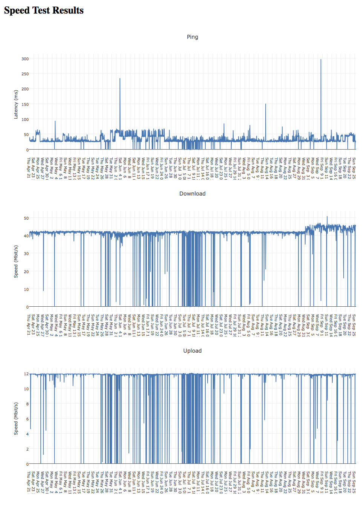

# periodic_internet_speed_test_logger
An internet speed test logger with an installer for periodic running

A typical use case would be to run install clone this repository on a raspberry pi or other Linux computer. Then, run the install script, install_cronscript.bash. After a few days, check the data/internet_speed_test_data.csv file for results.

